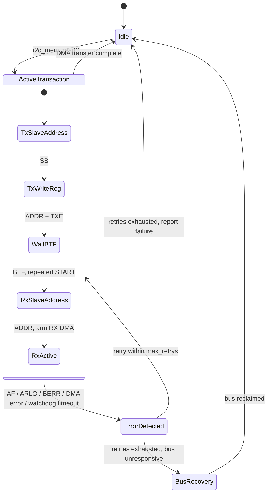

# STM32 Fault-Tolerant I2C Driver

Bare-metal, interrupt- and DMA-driven I2C driver for STM32F4, built around one premise: **the bus eventually misbehaves, and the driver should survive that.**

**Platform:** STM32F446RE (Nucleo-F446RE), CMSIS / LL register-level

## Why this exists

Most I2C drivers assume the happy path: address, ACK, transfer, done. In practice, I2C buses lock up — a slave resets mid-transaction and holds SDA low, a NACK shows up where you didn't expect one, noise trips a bus-error flag. ST's own HAL has limited answers for any of this beyond returning a generic timeout.

This driver was built to close that gap: every transaction is watched by a hardware timeout, every I2C error interrupt (NACK, arbitration lost, bus error) is handled explicitly, and failures are retried with a bounded policy instead of hanging or failing silently. Bus recovery — physically un-sticking a wedged bus by bit-banging SCL — is designed and is the next piece to be implemented.

## Design goals

- **Slave-agnostic.** The driver has no knowledge of any specific sensor. It exposes a register-read primitive (`i2c_mem_read`) — what's read and how it's interpreted is entirely up to the caller.
- **Instance-agnostic.** Works against I2C1, I2C2, or I2C3, and any DMA1 stream/channel combination, via a handle struct rather than hardcoded peripheral names.
- **Reusable.** Built to be dropped into a new project without rewriting the transaction logic — only the handle configuration changes.
- **Fault-tolerant by construction**, not by exception handling bolted on afterward.

## Architecture



A transaction is a write phase (slave address, then register address) followed by a repeated START into a read phase, with byte reception handed off to DMA once the read address is ACKed. Every step of that sequence is watched by a hardware timer; if nothing happens within the configured window, the driver treats it as a fault rather than hanging indefinitely.

## What makes this fault-tolerant

- **Hardware watchdog timeout** (TIM14) armed on every transaction start and disarmed on clean completion — the backstop for failures that don't raise any flag at all, such as a bus gone silent because a slave is stuck holding SDA low.
- **Explicit I2C error interrupt handling** — NACK (AF), arbitration lost (ARLO), and bus error (BERR) are each detected, cleared, and routed through a decision, rather than left to a generic timeout.
- **DMA transfer-error detection** on the RX stream, independent of the I2C peripheral's own error flags.
- **Bounded retry policy** — `max_retrys` in the handle caps automatic retries; the driver reports failure instead of retrying forever against a bus that isn't coming back.
- **Bus recovery** *(designed, implementation in progress)* — manual SCL toggling to release a slave stuck holding SDA low, followed by a clean peripheral reinit.

## Milestones
- [x] Compilation using arm-none-eabi-gcc, CMSIS/LL, no HAL
- [ ] Full end-to-end test against a real slave device (BME280)
- [ ] Fault-injection test harness to force NACK and stuck-bus scenarios

## How to use

```c
i2c_handle_t i2c_handle = {
    .sda_port = GPIOB,
    .scl_port = GPIOB,
    .sda_pin  = 7,
    .scl_pin  = 6,
    .i2c      = I2C1,
    .slave_addr = 0x76,   // e.g. BME280
    .slave_reg  = 0xD0,   // e.g. chip ID register
    .state = I2C_IDLE, // idle
    .max_retrys = 1,
};

dma_handle_t dma_handle = {
    .rx_stream = 0,
    .rx_channel = 1,
    .rx_buffer = buffer,
    .rx_nb_transfers = 1,
};

if (i2c_init(&i2c_handle, &dma_handle) != I2C_OK) {
    // handle initialization error
}

i2c_mem_read(&i2c_handle, &dma_handle, i2c_handle.slave_addr);
// Returns once the transaction is INITIATED, not complete.
// Completion is signaled asynchronously via i2c_handle.state coming back to IDLE
// (I2C_IDLE), set from DMA interrupt context.
```

Correct DMA stream/channel selection for the chosen I2C instance is the caller's responsibility — see the alternate function table in the STM32F446 datasheet.

It is advised that i2c_bus_recovery() function is called at startup to ensure the bus is in a known good state before any transactions are attempted.

### Timeout tuning

The watchdog is timer-driven, not a spin count, so it needs to be set against your actual clock tree:

```c
#define APB1_TIM_CLK_HZ   50000000UL   // TIM14 input clock — check CubeMX "APB1 Timer clocks", not plain APB1
#define TIMER_TICK_HZ     10000UL      // 10 kHz tick -> 100 us resolution
#define TIMEOUT_CLK_CNT   300          // 300 * 100 us = 30 ms timeout, tune to your bus
```

## Design decisions and trade-offs

| Decision | Why |
|---|---|
| CMSIS/LL register access, no HAL | Every transaction step is visible and inspectable — the point of this project is understanding and controlling failure modes HAL abstracts away. |
| Handle struct per instance | Same pattern HAL/LL use, for the same reason: one driver, any I2C instance, any DMA stream, no hardcoded globals. |
| DMA used for RX only | The write phase is a single register-address byte — DMA setup/interrupt overhead isn't worth it for one byte; the multi-byte sensor read is where DMA earns its place. |
| Async, interrupt-driven, not polling | The CPU is free during a transaction rather than blocked in a wait loop — the realistic pattern for anything power-conscious or doing other work concurrently. |
| Timer-based timeout, not a loop counter | A spin-counter has no relationship to real elapsed time and breaks entirely once the driver is non-blocking; a hardware timer is required once the CPU isn't sitting in the wait loop itself. |

## Status

Actively testing against a **BME280** environmental sensor as the first real slave device.

**Implemented and interrupt/DMA-driven end to end:**
- Peripheral, GPIO, and DMA initialization
- Full protocol state machine (address, register write, repeated start, DMA-driven multi- and single-byte read)
- Watchdog timeout arm/disarm
- AF / ARLO / BERR error detection with bounded retry

**Not yet implemented:**
- Fault-injection test suite (forced NACK / stuck-bus scenarios)

**Descoped for now, may return later:**
- Software payload checksum — cut to keep focus on bus-level fault handling rather than data-integrity-after-the-fact. The BME280 doesn't support SMBus PEC, so a wire-level checksum isn't possible with this sensor; a software checksum would only protect the payload after reception, not the transaction itself.

## Roadmap

1. Fault-injection test harness — force a stuck bus and a forced NACK, confirm recovery and bounded retry both behave as designed.
2. Validate against the BME280 end to end (chip ID read, calibration read, measurement read).
3. Low-power STOP-mode sampling (future, separate milestone).

## Resources

- [I2C lock up prevention and recovery - PEBBLE BAY](https://pebblebay.com/i2c-lock-up-prevention-and-recovery/)
- [I2C Stuck Bus: Prevention Workarounds - TI](https://www.ti.com/lit/an/scpa069/scpa069.pdf?ts=1787653972528)

## License

MIT — see [LICENSE](./LICENSE).
