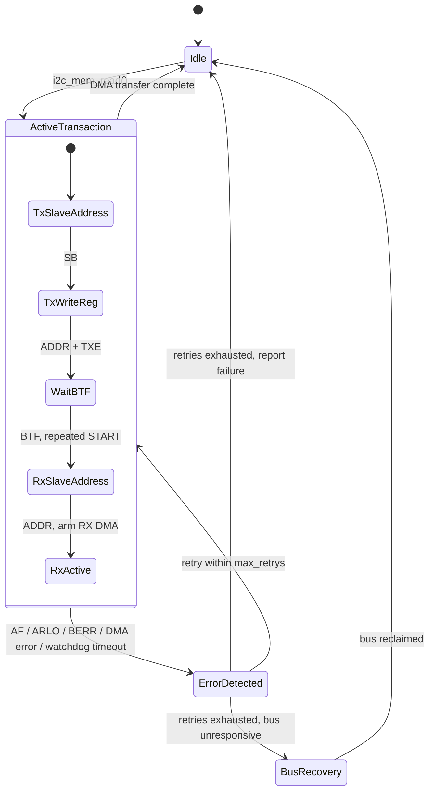

# STM32 Fault-Tolerant I2C Driver

Bare-metal, interrupt- and DMA-driven I2C driver for STM32F4, built around one premise: **the bus eventually misbehaves, and the driver should survive that.**

**Platform:** STM32F446RE (Nucleo-F446RE), CMSIS / LL register-level

## Why this exists

Most I2C drivers assume the happy path: address, ACK, transfer, done. In practice, I2C buses lock up — a slave resets mid-transaction and holds SDA low, a NACK shows up where you didn't expect one, noise trips a bus-error flag. ST's own HAL has limited answers for any of this beyond returning a generic timeout.

This driver was built to close that gap: every transaction is watched by a hardware timeout, every I2C error interrupt (NACK, arbitration lost, bus error) is acknowledged, and failures are retried with a bounded policy instead of hanging or failing silently. Bus recovery — physically un-sticking a wedged bus by bit-banging SCL.

## Design goals

- **Slave-agnostic.** The driver has no knowledge of any specific sensor. It exposes a register-read primitive (`i2c_mem_read`) — what's read and how it's interpreted is entirely up to the caller.
- **Instance-agnostic.** Works against I2C1, I2C2, or I2C3, and any DMA1 stream/channel combination, via a handle struct rather than hardcoded peripheral names.
- **Reusable.** Built to be dropped into a new project without rewriting the transaction logic — only the handle configuration changes.
- **Fault-tolerant by construction**, not by exception handling bolted on afterward.

## Architecture



A transaction is a write phase (slave address, then register address) followed by a repeated START into a read phase, with byte reception handed off to DMA once the read address is ACKed. Every step of that sequence is watched by a hardware timer; if nothing happens within the configured window, the driver treats it as a fault rather than hanging indefinitely.

## What makes this fault-tolerant

- **Hardware watchdog timeout** (TIM14) armed on every transaction start and disarmed on clean completion — the backstop for failures that don't raise any flag at all, such as a bus gone silent because a slave is stuck holding SDA low.
- **Explicit I2C error interrupt handling** — NACK (AF), arbitration lost (ARLO), and bus error (BERR) are each detected, cleared, and routed through a decision, rather than left to a generic timeout.
- **DMA transfer-error detection** on the RX stream, independent of the I2C peripheral's own error flags.
- **Bounded retry policy** — `max_retrys` in the handle caps automatic retries; the driver reports failure instead of retrying forever against a bus that isn't coming back.
- **Bus recovery** — manual SCL toggling to release a slave stuck holding SDA low, followed by a clean peripheral reinit.

## API Documentation

This driver features a single master - multiple slave design, with one I2C instance and one DMA stream/channel per handle. The caller is 
responsible for configuring the handle with the correct peripheral, GPIO, and DMA stream/channel for their chosen I2C instance.

DMA is used for RX only; the write phase is a single register-address byte, so DMA setup/interrupt overhead isn't worth it for one byte. If you 
plan to use this driver for multibyte writes, feel free to extend it with a DMA-driven write phase.

The driver is non-blocking and interrupt-driven; `i2c_mem_read()` returns immediately once the transaction is initiated, and completion is 
signaled asynchronously via `i2c_handle_t.state` returning to `I2C_IDLE`. The caller can poll this state or wait on a semaphore/event in an RTOS 
context.

In case the `i2c_handle_t.state` returns `I2C_BUS_UNAVAILABLE`, the bus is wedged and the driver has attempted recovery. The recommended procedure 
once the channel returns to normal operation is to call `i2c_init()` + `i2c_clear_bus_unavailable()` to reinitialize the peripheral and clear the 
bus error state.

### Structs

```i2c_handle_t``` — configuration and state for one I2C instance

```dma_handle_t``` — configuration and state for one DMA stream/channel

### Functions

```i2c_init(i2c_handle_t *i2c, dma_handle_t *dma)``` — initialize the I2C peripheral, GPIO, and RX DMA

```i2c_mem_read(i2c_handle_t *i2c, dma_handle_t *dma)``` — initiate a register read transaction; returns immediately, completion is signaled asynchronously via `i2c->state` returning to `I2C_IDLE`

```i2c_clear_bus_unavailable(i2c_handle_t *i2c)``` — clear the bus error state by setting it back to `I2C_IDLE`

```void (*callback)(uint8_t *buffer, uint32_t length)``` — optional callback
invoked by `i2c_dma_rx_irq_handler()` after a successful RX DMA transfer. The
callback receives `dma_handle->rx_buffer` and `dma_handle->rx_nb_transfers` as
its buffer and byte-count arguments. It runs in DMA interrupt context, so it
should be short and must not block. Pass `NULL` to disable the callback.

### Interrupt Handlers

The driver exposes interrupt functions that must be called from the CMSIS
IRQ handlers for the configured I2C instance, DMA stream, and TIM14:

- `i2c_ev_irq_handler(...)` advances the I2C transaction state machine for
    start, address, transmit-buffer-empty, and byte-transfer-finished events.
    During the read phase it disables I2C buffer interrupts and arms RX DMA.
- `i2c_dma_rx_irq_handler(...)` handles RX DMA transfer-complete and
    transfer-error flags. A successful transfer stops the watchdog, completes
    the transaction, and invokes the callback with the received buffer and
    byte count; a DMA error is recorded for timeout/error handling.
- `i2c_er_irq_handler(...)` acknowledges I2C acknowledge-failure (NACK),
    arbitration-lost, and bus-error flags. NACK and arbitration loss abort the
    current transaction; bus errors are retried up to `max_retrys`.
- `i2c_tim_irq_handler(...)` handles the TIM14 watchdog expiry, stops the
    transaction, and invokes bus recovery when the bus is suspected to be stuck.
    If recovery cannot release the bus, the state becomes
    `I2C_BUS_UNAVAILABLE`.

The handles must remain accessible from interrupt context, so they are usually
declared at file scope. The wrapper names below are for the `I2C1`,
`DMA1_Stream0`, and `TIM14` configuration used in the example; use the CMSIS
vector names matching a different peripheral or DMA stream.

## Use Example

> **⚠️ WARNING — External pull-up resistors required on SDA and SCL**
>
> This driver configures the SDA and SCL GPIO pins as **open-drain with no
> internal pull-up** (`PUPDR = 00`). The STM32's internal pull-up resistors
> are too weak and unreliable for I2C bus operation.
>
> **You must provide external pull-up resistors on both SDA and SCL,**
> pulled up to the I2C bus voltage (VDD, typically 3.3V).
>
> Without external pull-ups, SDA and SCL will not reliably reach a valid
> logic-high level, and the driver will fail to communicate with any slave
> device.

```c
i2c_handle_t i2c_handle = {
    .sda_port = GPIOB,
    .scl_port = GPIOB,
    .sda_pin  = 7,
    .scl_pin  = 6,
    .i2c      = I2C1,
    .slave_addr = 0x76,   // e.g. BME280
    .slave_reg  = 0xD0,   // e.g. chip ID register
    .state = I2C_IDLE, // idle
    .max_retrys = 1,
};

dma_handle_t dma_handle = {
    .rx_stream = DMA1_Stream0,
    .rx_stream_n = 0,
    .rx_channel_n = 1,
    .rx_buffer = buffer,
    .rx_nb_transfers = 1,
};

if (i2c_init(&i2c_handle, &dma_handle) != I2C_OK) {
    // handle initialization error
}


/* 
    In case you want to read multiple bytes - update i2c and dma handle and
    initiate a new transaction.
*/
i2c_handle.slave_reg = 0xF7; // e.g. BME280 pressure MSB register
dma_handle.rx_nb_transfers = 3; // read 3 bytes (pressure MSB, LSB, XLSB)
i2c_mem_read(&i2c_handle, &dma_handle);
/*
    Returns once the transaction is INITIATED, not complete.
    Completion is signaled asynchronously via i2c_handle.state coming back to 
    I2C_IDLE, set from DMA Transfer Complete interrupt context.
*/

void callback_function(uint8_t *buffer, uint32_t length)
{
    // Process the received bytes.
    (void)buffer;
    (void)length;
}

/* CMSIS IRQ wrappers for the configuration above. */
void I2C1_EV_IRQHandler(void)
{
    i2c_ev_irq_handler(&i2c_handle, &dma_handle);
}

void I2C1_ER_IRQHandler(void)
{
    i2c_er_irq_handler(&i2c_handle, &dma_handle);
}

void DMA1_Stream0_IRQHandler(void)
{
    i2c_dma_rx_irq_handler(&i2c_handle, &dma_handle, &callback_function);
}

void TIM8_TRG_COM_TIM14_IRQHandler(void)
{
    i2c_tim_irq_handler(&i2c_handle, &dma_handle);
}
```

>Correct DMA stream/channel selection for the chosen I2C instance is the caller's responsibility — see the alternate function table in the STM32F446 datasheet.

### Timeout tuning

The watchdog is timer-driven, not a spin count, so it needs to be set against your actual clock tree:

```c
#define APB1_TIM_CLK_HZ 50000000U		// TIM14 input clock
#define APB1_PERIPH_CLK_HZ 25000000U	// Peripheral clock in APB1
#define TIMER_TICK_HZ 10000U			// 10 kHz -> 100 us per tick
#define TIMEOUT_CLK_CNT 50U				// e.g. 50 * 100us = 5 ms timeout, tune to your bus
#define I2C_SCL_FREQ_HZ 100000U			// 100 kHz Standard Mode
```

Always account for the timeout to be ~1 tick longer than the actual timeout you want.
E.g., if you define `TIMEOUT_CLK_CNT = 50`, the actual timeout is ~51 ticks, or ~5.1 ms at a 10 kHz tick rate.

## Design decisions and trade-offs

| Decision | Why |
|---|---|
| Handle struct per instance | Same pattern HAL/LL use, for the same reason: one driver, any I2C instance, any DMA stream, no hardcoded globals. |
| DMA used for RX only | The write phase is a single register-address byte — DMA setup/interrupt overhead isn't worth it for one byte; the multi-byte sensor read is where DMA earns its place. |
| Async, interrupt-driven, not polling | The CPU is free during a transaction rather than blocked in a wait loop — the realistic pattern for anything power-conscious or doing other work concurrently. |
| Timer-based timeout, not a loop counter | A spin-counter has no relationship to real elapsed time and breaks entirely once the driver is non-blocking; a hardware timer is required once the CPU isn't sitting in the wait loop itself. |

## Tests & Validation

The driver was validated on real hardware using an **STM32F446RE**, **I2C1** and a **BME280** sensor at **100 kHz** I2C bus speed. Timing measurements were performed using the **DWT cycle counter** at a 50 MHz CPU clock.

The test campaign covers both normal operation and fault-handling scenarios:

| Test                              | Result                                    |
| --------------------------------- | ----------------------------------------- |
| Normal single transaction         | ~392.8 µs to STOP                         |
| 100 consecutive transactions      | **100/100 successful**                    |
| Timing determinism                | **CV = 0.035%**                           |
| AF / NACK detection               | **100/100 detected**                      |
| Watchdog timeout                  | Verified at different tick configurations |
| Bus recovery — SDA stuck low      | **100/100 correctly detected**            |
| Bus recovery — successful release | **100/100 automatically recovered**       |

### Key Results

* Normal transactions showed an average execution time of **~392.8 µs**, close to the theoretical bus time of ~390 µs.
* Timing measurements over 100 transactions showed highly deterministic behaviour, with a **0.035% coefficient of variation** and no significant drift or outliers.
* Address failure (**AF/NACK**) was consistently detected in all 100 fault-injection attempts.
* Watchdog behaviour was validated with different tick frequencies and timeout values, confirming the expected timeout mechanism and its timing margin.
* The bus-recovery mechanism was tested both when **SDA remained permanently stuck low** and when the bus was successfully released during recovery.
  For the complete test methodology, measurements, fault-injection setup and analysis, see:

**[Detailed Test Analysis →](docs/TEST_ANALYSIS.md)**


## Resources

- [I2C lock up prevention and recovery - PEBBLE BAY](https://pebblebay.com/i2c-lock-up-prevention-and-recovery/)
- [I2C Stuck Bus: Prevention Workarounds - TI](https://www.ti.com/lit/an/scpa069/scpa069.pdf?ts=1787653972528)

## License

MIT — see [LICENSE](./LICENSE).
